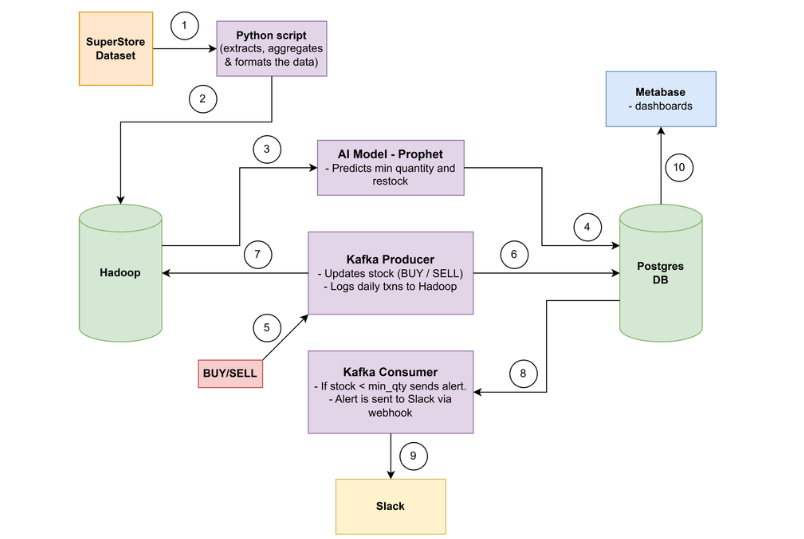
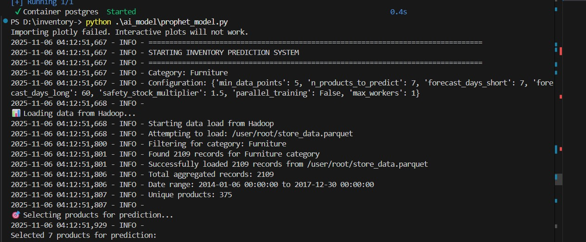
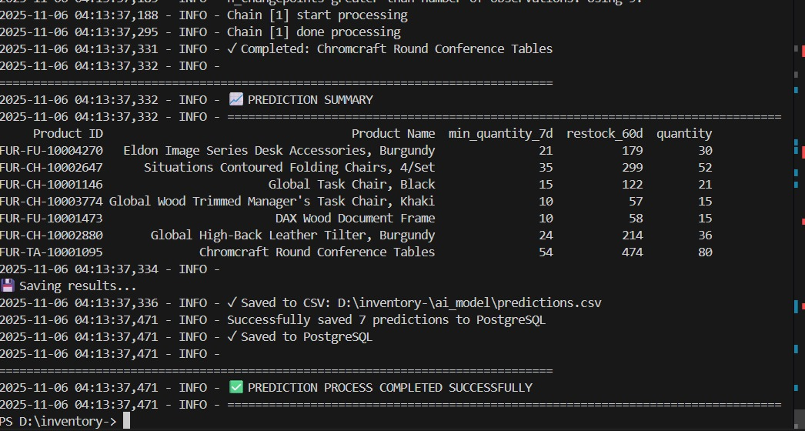
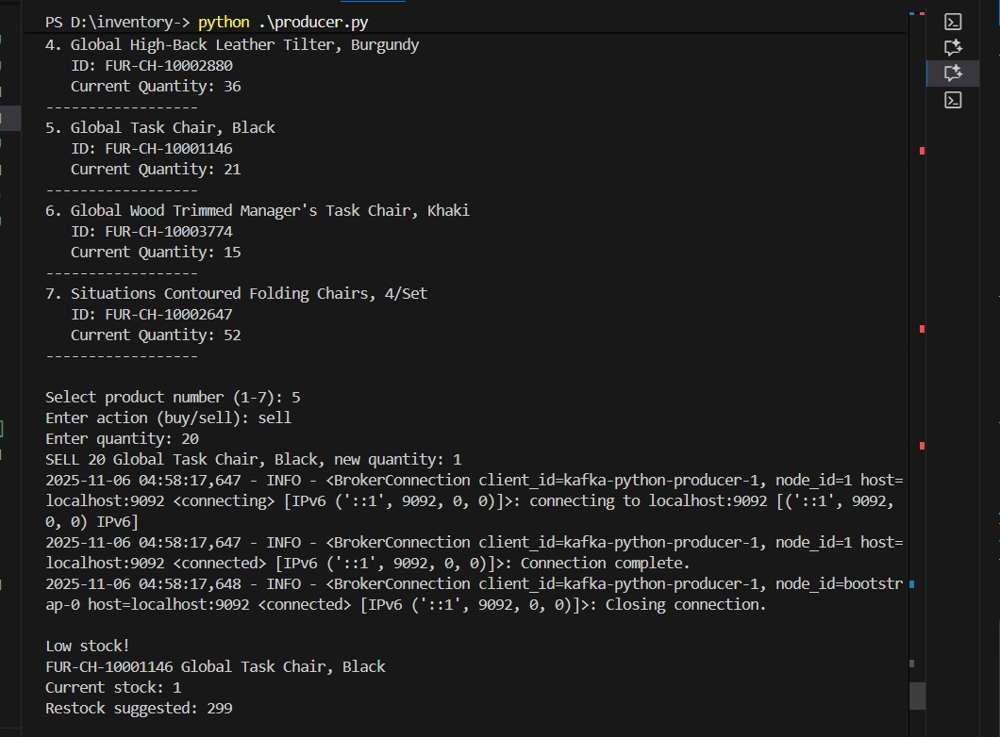
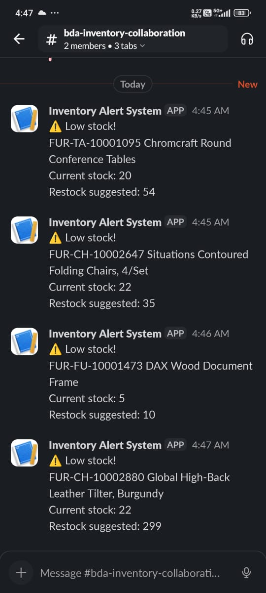

# **AI-Enhanced Event-Driven Inventory Management System**

This project implements an end-to-end **inventory management system** combining **real-time event streaming**, **AI-based demand forecasting**, and **automated alerts**.

---

## **📌 Features**

### **1. Demand Forecasting (Prophet)**

* Forecasts **minimum stock (next 7 days)**
* Forecasts **restock quantity (next 60 days)**
* Runs automatically using a **weekly CRON job**

### **2. Event-Driven Architecture (Kafka)**

* Producer generates BUY/SELL events
* Consumer updates PostgreSQL in real-time
* Ensures instant and accurate inventory tracking

### **3. Big Data Storage (Hadoop)**

* Stores historical sales data
* Supports large-scale analysis and Prophet training

### **4. Operational Database (PostgreSQL)**

* Maintains current inventory
* Stores Prophet predictions
* Powers dashboards + alerts

### **5. Automated Slack Alerts**

* Low-stock notifications sent via webhooks
* Helps prevent stockouts

### **6. Metabase Dashboard**

* Visualizes stock levels, trends, and predictions
* Filters by product, region, category, etc.

---

## **📂 System Architecture**

---

## **📊 Dataset**

### **Superstore Dataset**

* ~9,994 rows
* Includes product details, category, segment, sales, discount, profit, shipping info
* Time range: **2014–2017**
* Aggregated into daily sales for Prophet

---

## **🧰 Tech Stack**

* **Kafka** (event streaming)
* **Hadoop** (data lake)
* **PostgreSQL** (operational DB)
* **Prophet** (forecasting model)
* **Slack Webhooks** (alerts)
* **Metabase** (dashboard)
* **CRON** (scheduled jobs)
* **Python**

---

## **🔄 Workflow**

1. **Sales events** → sent to Kafka Producer
2. Kafka → **PostgreSQL updates** via Consumer
3. Daily sales summary → stored in **Hadoop**
4. Weekly **CRON job** runs Prophet forecasting
5. Predictions saved back to **PostgreSQL**
6. Slack sends **low-stock alerts**
7. Metabase reads PostgreSQL → **dashboard visualizations**

---

## **🖼️ Screenshots**

Add your images:

---

## **👥 Team**

* Gautam
* Harshini
* * (add remaining team members if needed)

---

## **🔗 GitHub Repository**

[https://github.com/your-repo-here](https://github.com/your-repo-here)

---

If you want, I can also make:
✅ a **shorter README**
✅ a **more aesthetic README with badges**
✅ a **project description for placements**
Just tell me!

